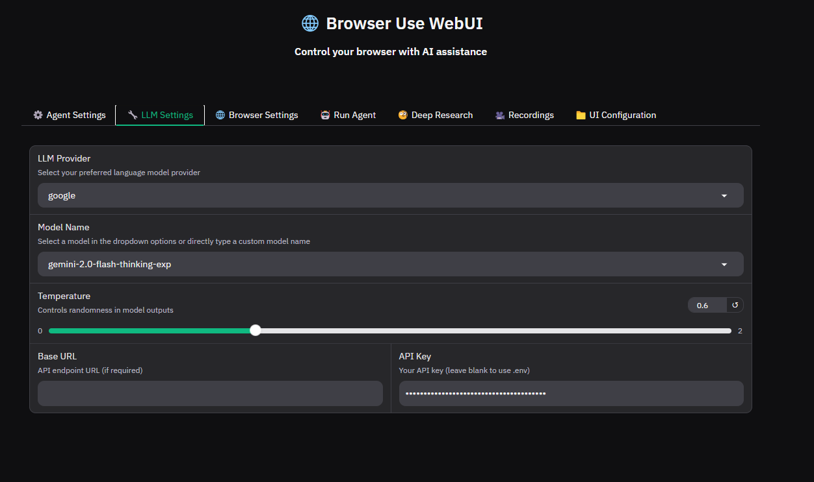
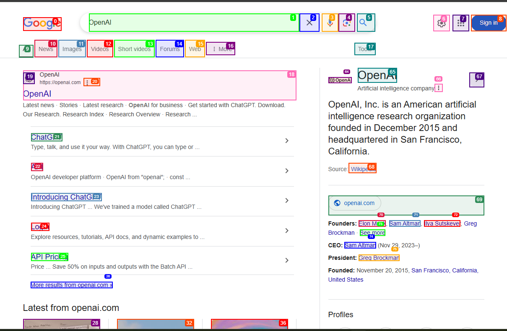
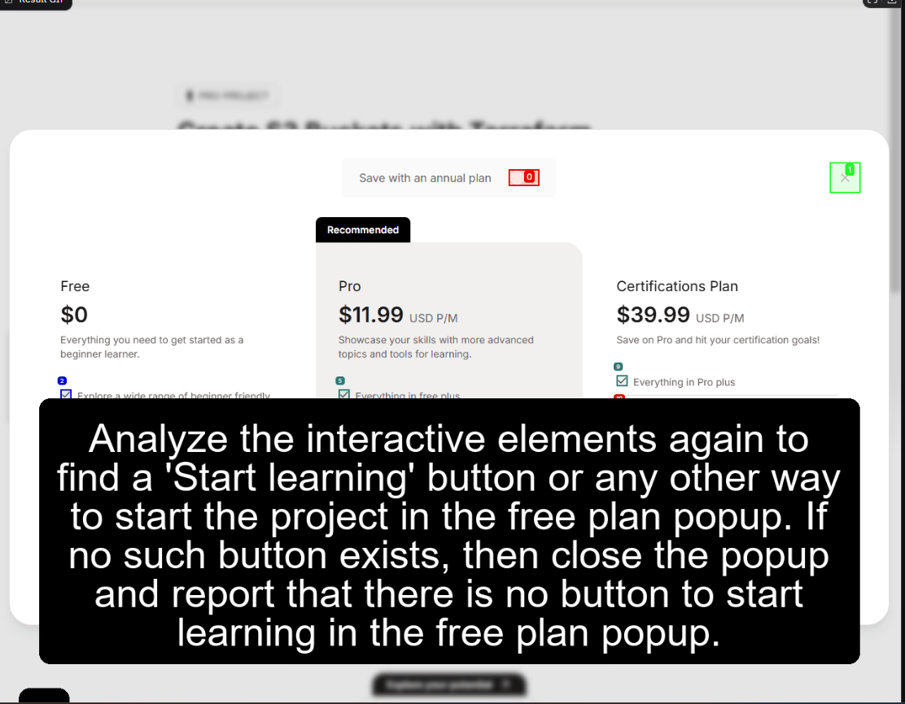
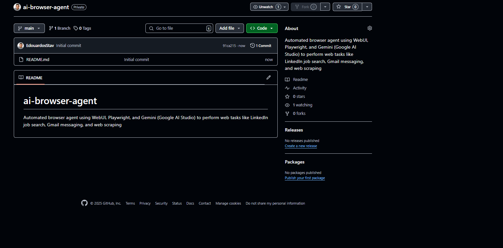

# 🤖 AI Browser Agent – Web Automation with AI

A personal AI-powered browser agent that automates repetitive web tasks using **WebUI**, **Playwright**, and **Gemini (Google AI Studio)**. Built to simplify actions like job search, messaging, and scraping—by talking to an agent, not coding.

---

## 🚀 What This Project Does
This AI agent interacts with websites like a human:
- Performs job searches on **LinkedIn**
- Sends messages via **Gmail**
- Extracts links from **Google**, **Instagram**, and **Substack**
- Navigates your actual logged-in **Chrome session**

No Selenium scripts or manual XPath scraping—just smart prompting and WebUI.

---

## 🎯 Why I Built This
As part of my journey into AI automation, I wanted to:
- Learn **AI + Browser** integration
- Practice **prompt engineering** for real-world tasks
- Explore **agentic behavior** without writing complex automation scripts
- Build something I could use again in job search, outreach, and productivity

---

## 🧠 Core Concepts Learned
| Topic | What I Learned |
|-------|----------------|
| **WebUI** | Visual prompt interface to control agents |
| **Browser Use** | How the agent "sees" and interacts with the browser |
| **Playwright** | The backend browser control engine |
| **Prompt Engineering** | How to write clear, structured commands |
| **Google Gemini** | Used as the reasoning model (via API key) |
| **Session Control** | Agent uses my **real Chrome** session, so it’s already logged in |

---

## 🖼️ Key Screenshots

| WebUI Running | Gemini Setup |
|---------------|--------------|
|  |  |

| Google Task | LinkedIn Task |
|-------------|----------------|
|  |  |

---

## 🧪 Example Prompts I Used
```text
Prompt: Search for "OpenAI" and extract the first result’s URL.
Prompt: Scroll through a page and get all Instagram/Substack links.
Prompt: Open LinkedIn, search for Software Engineer in Dublin, and read the top 3 listings.
Prompt: Log in to Gmail and send a message to X with a meme attached.
```

---

## ⚙️ How To Run It Yourself
### 🧩 Prerequisites
- Windows OS
- Python (3.10+), Git, Pip
- `uv` (or `pip install uv`)
- Google Chrome (you’ll use your real profile)

### 📦 Setup
```bash
git clone https://github.com/your-username/ai-browser-agent
cd ai-browser-agent
uv venv && uv pip install -r requirements.txt
```

### 🔐 Environment Setup
Create a `.env` file:
```
GOOGLE_API_KEY=your-gemini-api-key
CHROME_PROFILE_PATH=C:\\Users\\yourname\\AppData\\Local\\Google\\Chrome\\User Data
```

### 🚀 Start WebUI
```bash
python webui.py --ip 127.0.0.1 --port 7788
```

Then visit: `http://127.0.0.1:7788`

---

## 📚 Dependencies (Main Ones)
- `playwright`
- `uvicorn`
- `openai` + `google` (Gemini)
- `dotenv`, `requests`, `pyppeteer`, `typing`, `starlette`

Full list in `requirements.txt`

---

## 🏁 Lessons & Reflections
This project was a game-changer in how I think about browser automation:
- I don’t need hardcoded selectors anymore
- AI agents + real browser sessions = true automation
- Prompt engineering is a skill worth mastering

---

## 🙌 Special Thanks
Built as part of a course by **NextWork**. Modified, extended, and documented for my personal learning & portfolio.

---

## 📌 Author
**Edouardos Stavrakis**  
AI Enthusiast | Software Engineer | DevOps Explorer

Feel free to connect on [LinkedIn](https://www.linkedin.com/in/your-profile/) or check my other projects.

---

## 🗂 Folder Structure (simplified)
```
├── webui.py
├── .env
├── requirements.txt
├── assets/
│   ├── webui-agent-settings.png
│   ├── webui-gemini-settings.png
│   ├── ai-agent-google-result.png
│   ├── linkedin-search-job.png
```

---

## 📌 Note
This is a **prototype**. It worked perfectly on my machine with a Chrome session already authenticated. Some advanced use cases (e.g. job apply flow) may require prompt tweaking.

---

## ⭐ Like it?
Give it a ⭐ and fork it for your own automations!
